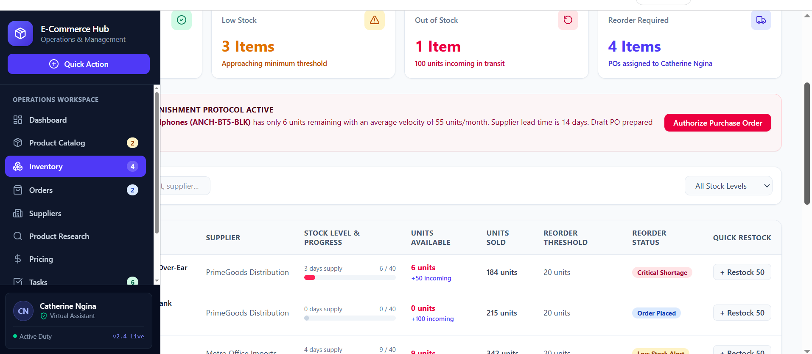
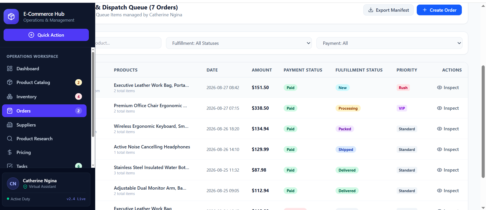
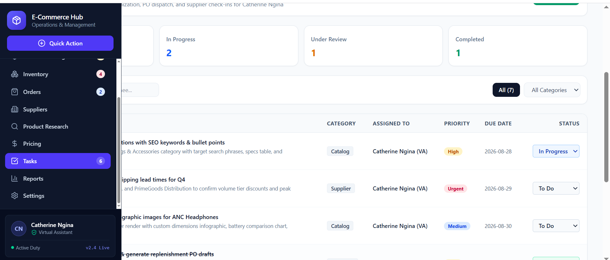

# 🛍️ E-Commerce Operations & Product Management Hub

### Virtual Assistant Portfolio Project

A professional e-commerce operations dashboard demonstrating how a Virtual Assistant can support product management, inventory coordination, order processing, supplier management, product research, pricing analysis, task management, and performance reporting.

> **Portfolio Demo:** This project uses fictional sample data and does not represent real clients, customers, or personal information.

---
## 📸 Project Screenshots

### Executive Operations Dashboard

### Product Catalog

### Inventory Management

### Orders Management

### Task Management

---

## 📌 Project Overview

This project demonstrates a full-cycle e-commerce operations workflow managed by a Virtual Assistant.

The system brings product management, inventory monitoring, order coordination, supplier management, product research, pricing analysis, task management, and reporting into one organized workspace.

The goal is to demonstrate how structured administrative and e-commerce processes can help an online business maintain accurate product data, monitor inventory, coordinate orders, and track operational performance.

---

## 🎯 Objectives

- Research and organize products
- Maintain accurate product information
- Manage product listings
- Monitor inventory levels
- Identify low-stock and reorder requirements
- Coordinate order processing
- Manage supplier information
- Conduct product research
- Compare pricing and profit margins
- Track operational tasks
- Monitor e-commerce performance
- Generate business reports

---

## ⚙️ Key Features

### 🛍️ Product Catalog
- Product database
- SKU management
- Product categories
- Supplier information
- Pricing
- Listing status
- Search and filtering

### 📦 Inventory Management
- Stock-level monitoring
- Low-stock alerts
- Reorder tracking
- Inventory status
- Supplier coordination

### 🧾 Order Management
- Order tracking
- Payment status
- Fulfillment status
- Priority management
- Order details

### 🤝 Supplier Management
- Supplier database
- Product categories
- Lead times
- Supplier performance
- Order history

### 🔎 Product Research
- Market research
- Competitor pricing
- Suggested selling prices
- Estimated profit margins
- Research status

### 💰 Pricing Management
- Cost price
- Selling price
- Competitor average
- Profit margin
- Recommended pricing

### ✅ Task Management
- Product listing tasks
- Inventory tasks
- Supplier follow-ups
- Pricing reviews
- Order-related tasks
- Due dates and priorities

### 📊 Reporting
- Monthly revenue
- Order performance
- Product performance
- Inventory activity
- Profit margins
- Operational KPIs

---

## 🔄 E-Commerce Operations Workflow

Product Research  
↓  
Supplier Verification  
↓  
Product Data Entry  
↓  
Pricing Analysis  
↓  
Product Listing  
↓  
Inventory Monitoring  
↓  
Order Management  
↓  
Performance Reporting

---

## 🧰 Skills Demonstrated

- E-Commerce Administration
- Product Listing Management
- Data Entry & Data Management
- Product Research
- Inventory Coordination
- Order Management
- Supplier Management
- Pricing Research
- Administrative Support
- Task Management
- Reporting & Documentation
- Virtual Assistant Operations

---

## 💻 Technology

- React
- TypeScript
- Vite
- Tailwind CSS
- Local Mock Data
- Responsive UI Design

---

## 👩🏽‍💻 Portfolio Context

**Created by Catherine Ngina**  
Virtual Assistant | E-Commerce & Administrative Operations

This fictional portfolio project demonstrates practical e-commerce administration and operational support workflows.

---

## 📄 Disclaimer

This is a fictional portfolio demonstration. All businesses, products, customers, suppliers, figures, and operational data shown in this project are sample data created for demonstration purposes only.
